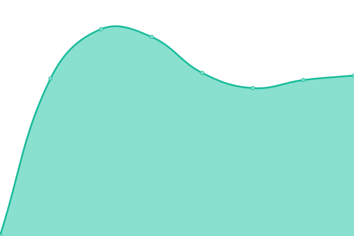
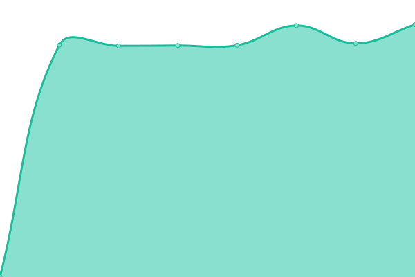
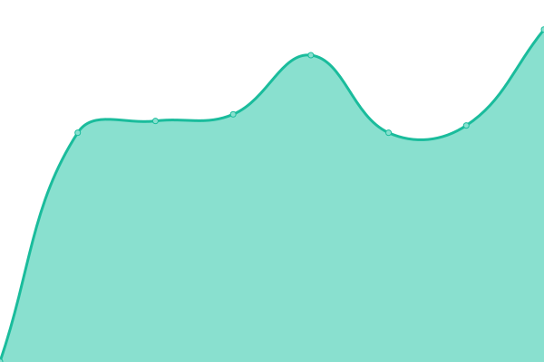

# [📈 Live Status](https://nvgsg.github.io/lab-upptime): <!--live status--> **🟧 Partial outage**

This repository contains the open-source uptime monitor and status page for [NovaGlobal Pte Ltd](novaglobal.com.sg), powered by [Upptime](https://github.com/upptime/upptime).

With [Upptime](https://upptime.js.org), you can get your own unlimited and free uptime monitor and status page, powered entirely by a GitHub repository. We use [Issues](https://github.com/nvgsg/lab-upptime/issues) as incident reports, [Actions](https://github.com/nvgsg/lab-upptime/actions) as uptime monitors, and [Pages](https://nvgsg.github.io/lab-upptime) for the status page.

<!--start: status pages-->
<!-- This summary is generated by Upptime (https://github.com/upptime/upptime) -->
<!-- Do not edit this manually, your changes will be overwritten -->
<!-- prettier-ignore -->
| URL | Status | History | Response Time | Uptime |
| --- | ------ | ------- | ------------- | ------ |
|  [Authentication System](https://auth.lab.novaglobal.com.sg) | 🟩 Up | [authentication-system.yml](https://github.com/nvgsg/lab-upptime/commits/HEAD/history/authentication-system.yml) | 

 646ms
     
 | 

<a href="https://nvgsg.github.io/lab-upptime/history/authentication-system">100.00%</a>
    

|  [Cluster Monitoring UI](https://monitor.lab.novaglobal.com.sg) | 🟩 Up | [cluster-monitoring-ui.yml](https://github.com/nvgsg/lab-upptime/commits/HEAD/history/cluster-monitoring-ui.yml) | 

 998ms
     
 | 

<a href="https://nvgsg.github.io/lab-upptime/history/cluster-monitoring-ui">100.00%</a>
    

|  [Cluster Monitoring Database](https://prometheus.lab.novaglobal.com.sg) | 🟥 Down | [cluster-monitoring-database.yml](https://github.com/nvgsg/lab-upptime/commits/HEAD/history/cluster-monitoring-database.yml) | 

 614ms
     
 | 

<a href="https://nvgsg.github.io/lab-upptime/history/cluster-monitoring-database">0.00%</a>
    

|  [Cluster Notification System](https://alertmanager.lab.novaglobal.com.sg) | 🟩 Up | [cluster-notification-system.yml](https://github.com/nvgsg/lab-upptime/commits/HEAD/history/cluster-notification-system.yml) | 

 619ms
     
 | 

<a href="https://nvgsg.github.io/lab-upptime/history/cluster-notification-system">100.00%</a>
    

|  [Kubernetes Platform](https://kubesphere.lab.novaglobal.com.sg) | 🟥 Down | [kubernetes-platform.yml](https://github.com/nvgsg/lab-upptime/commits/HEAD/history/kubernetes-platform.yml) | 

 610ms
     
 | 

<a href="https://nvgsg.github.io/lab-upptime/history/kubernetes-platform">0.00%</a>
    

|  [Kubernetes Dashboard](https://dashboard.lab.novaglobal.com.sg) | 🟩 Up | [kubernetes-dashboard.yml](https://github.com/nvgsg/lab-upptime/commits/HEAD/history/kubernetes-dashboard.yml) | 

 614ms
     
 | 

<a href="https://nvgsg.github.io/lab-upptime/history/kubernetes-dashboard">100.00%</a>
    

|  [Container Registry](https://harbor.lab.novaglobal.com.sg) | 🟩 Up | [container-registry.yml](https://github.com/nvgsg/lab-upptime/commits/HEAD/history/container-registry.yml) | 

 597ms
     
 | 

<a href="https://nvgsg.github.io/lab-upptime/history/container-registry">100.00%</a>
    

|  [Container Image Verification](https://notary.lab.novaglobal.com.sg) | 🟥 Down | [container-image-verification.yml](https://github.com/nvgsg/lab-upptime/commits/HEAD/history/container-image-verification.yml) | 

 603ms
     
 | 

<a href="https://nvgsg.github.io/lab-upptime/history/container-image-verification">0.00%</a>
    

|  [Documentation Hub](https://docs.lab.novaglobal.com.sg) | 🟩 Up | [documentation-hub.yml](https://github.com/nvgsg/lab-upptime/commits/HEAD/history/documentation-hub.yml) | 

 664ms
     
 | 

<a href="https://nvgsg.github.io/lab-upptime/history/documentation-hub">100.00%</a>
    

|  [Lab Catalog](https://catalog.lab.novaglobal.com.sg) | 🟩 Up | [lab-catalog.yml](https://github.com/nvgsg/lab-upptime/commits/HEAD/history/lab-catalog.yml) | 

 604ms
     
 | 

<a href="https://nvgsg.github.io/lab-upptime/history/lab-catalog">99.84%</a>
    

|  [PufferAI HPC Portal](https://hpc.lab.novaglobal.com.sg) | 🟩 Up | [puffer-ai-hpc-portal.yml](https://github.com/nvgsg/lab-upptime/commits/HEAD/history/puffer-ai-hpc-portal.yml) | 

 1512ms
     
 | 

<a href="https://nvgsg.github.io/lab-upptime/history/puffer-ai-hpc-portal">88.75%</a>
    

|  [Kubeflow ML Platform](https://kubeflow.lab.novaglobal.com.sg) | 🟩 Up | [kubeflow-ml-platform.yml](https://github.com/nvgsg/lab-upptime/commits/HEAD/history/kubeflow-ml-platform.yml) | 

 1264ms
     
 | 

<a href="https://nvgsg.github.io/lab-upptime/history/kubeflow-ml-platform">66.47%</a>
    

|  [NVIDIA AI Enterprise Hub](https://nvaie.lab.novaglobal.com.sg) | 🟩 Up | [nvidia-ai-enterprise-hub.yml](https://github.com/nvgsg/lab-upptime/commits/HEAD/history/nvidia-ai-enterprise-hub.yml) | 

 712ms
     
 | 

<a href="https://nvgsg.github.io/lab-upptime/history/nvidia-ai-enterprise-hub">50.85%</a>
    

<!--end: status pages-->

[**Visit our status website →**](https://nvgsg.github.io/lab-upptime)

## 📄 License

- Powered by: [Upptime](https://github.com/upptime/upptime)
- Code: [MIT](./LICENSE) © [NovaGlobal Pte Ltd](novaglobal.com.sg)
- Data in the `./history` directory: [Open Database License](https://opendatacommons.org/licenses/odbl/1-0/)
